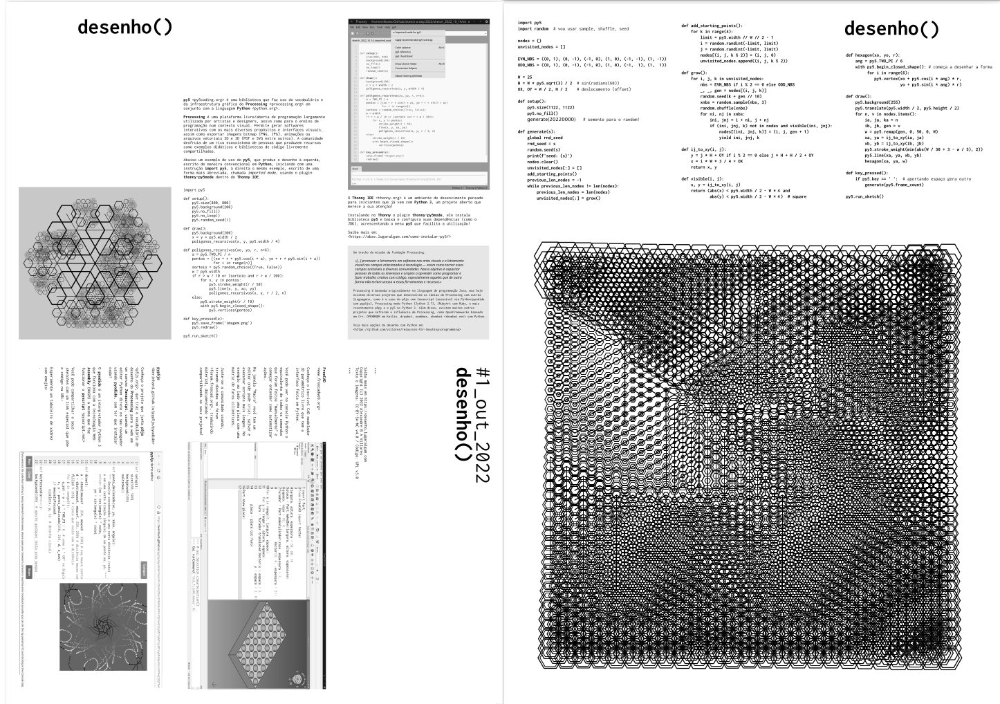

"""Para desenhar com código, para desenhar junto, com o computador e com outras pessoas!"""

---

<h2 style="font-family: inconsolata, monospace;">desenho() #1 outubro de 2022</h2>

Esta é a edição do zine/poster que foi distribuída na [Python Brasil 2022 Manaus](https://2022.pythonbrasil.org.br/) !

Agradecimentos: Clarissa R Mendes, Yorik van Havre, Aivar Annamaa, Organização da Python Brasil 2022 Manaus, Mariatta Wijaya, Luciano Ramalho, Fernando Masanori, Victor Osório e todos que apoiam os meus projetos! 

Se você quiser contribuir, faça um PIX para a chave `46c37783-5edb-4f1c-b3a8-1309db11488c`, ou mande uma doação em [gumroad.com/villares](https://gumroad.com/l/desenho1), com a opção de pedir o envio de um exemplar pelo correio! Você também pode apoiar de maneira recorrente os meus projetos [aqui](https://villares.gumroad.com/l/aunif).

O código que gera o zine completo está [aqui](https://github.com/villares/desenho-sem-argumentos/tree/main/1_outubro_2022). 

Devido a um bug no Processing 4 Java que é usado como infraestrutura pelo py5 ([mas que já está pra ser corrigido graças ao @Vepo](https://github.com/processing/processing4/pull/599)!) precisei gerar o zine ainda com o Processing Python Mode (que usa a infra do Processing 3). 

O código do pôster, que foi escrito inicialmente usando py5 está lá também.

**ERRATA/ATUALIZAÇÃO!** - Corrigi alguns erros de digitação e acrescentei a URL do tabuleiro de xadrez [https://t.ly/lvFi](https://t.ly/lvFi). 

>    **pyp5js** <berinhard.github.io/pyp5js/pyodide>
>
>    Conheça o projeto que junta p5js <p5js.org>, que traz o vocabulário de desenho do Processing para a web em um canvas Javascript, usando um editor Python direto no seu navegador usando pyodide, sem ter que instalar nada!
>    O pyodide é um interpretador Python 3 que funciona com a tecnologia Web Assembly (WASM) a mesma que faz funcionar o pyscript <pyscript.net>
>    Você pode compartilhar o seus sketches com um link especial que põe o código na URL.
>    Experimente um tabuleiro de xadrez com emojis: https://t.ly/lvFi 

---

<b>desenho()</b> # publicação independente de desenho e programação 
""" 
Copyright (C) 2019-2022 <a href="https://abav.lugaralgum.com">Alexandre B A Villares</a>.  
Texto e imagens: Licença Atribuição-NãoComercial-CompartilhaIgual 4.0 (<a href="https://creativecommons.org/licenses/by-nc-sa/4.0/deed.pt_BR">CC BY-NC-SA 4.0</a>). Código: Licença Pública Geral GNU (<a ref="https://github.com/villares/desenho-sem-argumentos/blob/master/LICENSE.txt">GPL v3.0</a>)
 """

